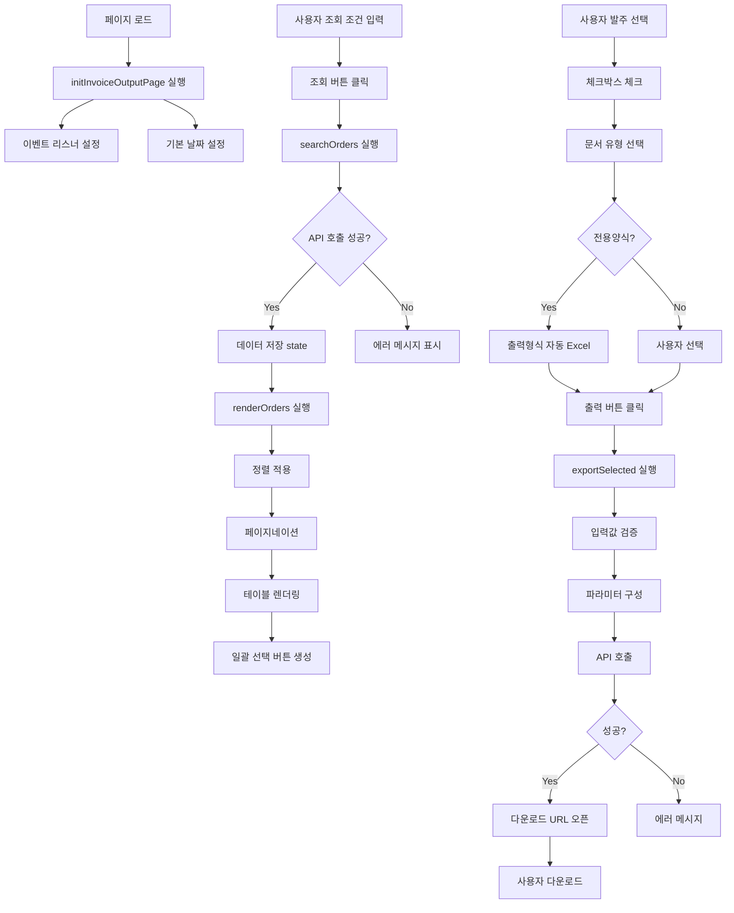

# CommonScripts.html - InvoiceOutput 페이지 완전 분석

## 📋 목차
1. [출력 관련 모든 함수 목록](#1-출력-관련-모든-함수-목록)
2. [UI 이벤트 핸들러](#2-ui-이벤트-핸들러)
3. [exportSelected() 함수 완전 분석](#3-exportselected-함수-완전-분석)
4. [UI 동적 제어 로직](#4-ui-동적-제어-로직)
5. [데이터 로딩 및 렌더링](#5-데이터-로딩-및-렌더링)
6. [유틸리티 함수](#6-유틸리티-함수)
7. [사용자 인터랙션 플로우](#7-사용자-인터랙션-플로우)

---

## 1. 출력 관련 모든 함수 목록

### 1.1 메인 초기화 함수

#### `OB.initInvoiceOutputPage()` (364-1339줄)
- **역할**: InvoiceOutput 페이지 전체 초기화 및 이벤트 바인딩
- **파라미터**: 없음
- **반환값**: 없음
- **호출 관계**:
  - `OB.initCurrentPage()` → `OB.initInvoiceOutputPage()`
  - 내부에서 여러 이벤트 핸들러 및 서브 함수 초기화

### 1.2 출력 실행 함수

#### `exportSelected()` (769-854줄)
- **역할**: 선택된 발주들을 PDF 또는 Excel로 출력
- **파라미터**: 없음 (DOM에서 직접 값 수집)
- **반환값**: 없음
- **API 호출**: `google.script.run.generateInvoiceZipApi(params)`
- **호출 관계**:
  ```
  사용자 클릭 → exportSelected()
               → 입력값 검증
               → 파라미터 구성
               → google.script.run.generateInvoiceZipApi()
               → 성공: 다운로드 URL 오픈
               → 실패: 에러 메시지
  ```

#### `exportPDF()` (857-859줄)
- **역할**: `exportSelected()` 호환성 래퍼 함수
- **파라미터**: 없음
- **반환값**: 없음
- **호출 관계**: `exportPDF()` → `exportSelected()`

#### `downloadExcel()` (394-450줄)
- **역할**: 발주 목록을 CSV 형식으로 다운로드
- **파라미터**: 없음 (state에서 데이터 참조)
- **반환값**: 없음
- **처리 로직**:
  1. 체크된 발주번호 수집
  2. 선택된 발주 필터링
  3. CSV 헤더 생성
  4. 데이터 행 생성
  5. BOM 추가 (한글 깨짐 방지)
  6. Blob 생성 및 다운로드

### 1.3 청구서 생성 함수

#### `OB.navigateToInvoice(orderNumber, company)` (218-257줄)
- **역할**: 특정 발주번호의 청구서 확인 및 네비게이션
- **파라미터**:
  - `orderNumber`: 발주번호 (string)
  - `company`: 거래처명 (string)
- **반환값**: 없음
- **API 호출**: `google.script.run.checkInvoiceExistsApi({ orderNumber })`

#### `OB.createDirectInvoiceForOrder(orderNumber, company)` (260-301줄)
- **역할**: 거래원장에서 청구서 직접 생성 (Track A - Fast Path)
- **파라미터**:
  - `orderNumber`: 발주번호 (string)
  - `company`: 거래처명 (string)
- **반환값**: 없음
- **API 호출**: `google.script.run.createDirectBillingApi(params)`

### 1.4 테이블 렌더링 함수

#### `renderOrders()` (642-702줄)
- **역할**: 발주 목록을 테이블로 렌더링 (정렬, 페이지네이션 포함)
- **파라미터**: 없음 (state 참조)
- **반환값**: 없음
- **호출 함수**:
  - `sortOrders()`
  - `updateSortIndicators()`
  - `renderPagination()`
  - `renderBulkSelectButtons()`

#### `renderEmpty()` (382-389줄)
- **역할**: 빈 결과 테이블 렌더링
- **파라미터**: 없음
- **반환값**: 없음

#### `renderPagination(totalPages)` (497-558줄)
- **역할**: 페이지네이션 UI 렌더링
- **파라미터**: `totalPages` (number) - 전체 페이지 수
- **반환값**: 없음

#### `renderBulkSelectButtons()` (563-609줄)
- **역할**: 브랜드/매입처별 일괄 선택 버튼 렌더링
- **파라미터**: 없음
- **반환값**: 없음

### 1.5 정렬 함수

#### `sortOrders(column, direction)` (455-482줄)
- **역할**: 발주 목록 정렬
- **파라미터**:
  - `column` (string): 정렬 컬럼명
  - `direction` (string): 'asc' 또는 'desc'
- **반환값**: 없음
- **처리 로직**:
  - 날짜: timestamp로 변환
  - 숫자: Number로 변환
  - 문자열: toLowerCase() 적용

#### `updateSortIndicators()` (484-492줄)
- **역할**: 정렬 상태 시각적 표시
- **파라미터**: 없음
- **반환값**: 없음

### 1.6 일괄 청구서 탭 함수들

#### 청구서 조회 (1058-1106줄)
- **이벤트**: `billing-search-btn` 클릭
- **API**: `google.script.run.aggregateBillingDataApi(params)`

#### 청구서 Excel 다운로드 (1173-1219줄)
- **이벤트**: `billing-export-xlsx` 클릭
- **처리**: CSV 생성 및 다운로드

#### 청구서 PDF 생성 (1221-1281줄)
- **이벤트**: `billing-export-pdf` 클릭
- **API**: `google.script.run.generateInvoiceZipApi(params)`

#### 청구서 DB 저장 (1283-1336줄)
- **이벤트**: `billing-save-db` 클릭
- **API**: `google.script.run.createBillingApi(params)`

---

## 2. UI 이벤트 핸들러

### 2.1 버튼 이벤트

| DOM ID | 이벤트 | 핸들러 함수 | 줄번호 |
|--------|--------|-------------|--------|
| `inv-search-btn` | click | `searchOrders()` | 866-869 |
| `inv-export-selected` | click | `exportSelected()` | 872-875 |
| `inv-export-xlsx` | click | `exportSelected()` | 878-881 |
| `inv-export-pdf` | click | `exportSelected()` | 882-885 |
| `inv-check-all` | change | 전체 체크박스 토글 | 888-896 |
| `inv-select-all` | click | 모두 선택 | 978-986 |
| `inv-deselect-all` | click | 모두 해제 | 988-997 |

### 2.2 입력 필드 이벤트

#### 문서 유형 변경 (898-936줄)
```javascript
document.getElementById('inv-doc-type').addEventListener('change', function() {
  var docType = this.value;

  // 1. 날짜 라벨 변경
  if (docType === 'ORDER_PURCHASE') {
    dateLabel.textContent = '발주일';
  } else if (docType.startsWith('CUSTOM_')) {
    dateLabel.textContent = '발주일';
  } else {
    dateLabel.textContent = '출고일';
  }

  // 2. 전용양식 선택 시 출력형식 자동 Excel로 변경
  if (docType.startsWith('CUSTOM_') && outputFormatSelect) {
    outputFormatSelect.value = 'EXCEL';
    outputFormatSelect.disabled = true;
  }

  // 3. 삐아계열 선택 시 납품일 필드 표시
  if (docType === 'CUSTOM_BBIA') {
    deliveryLabel.style.display = '';
    deliveryInput.style.display = '';
  } else {
    deliveryLabel.style.display = 'none';
    deliveryInput.style.display = 'none';
  }
});
```

**동적 UI 제어 로직**:
- 문서유형에 따라 날짜 라벨 변경 (발주일 ↔ 출고일)
- 전용양식 선택 시 출력형식 자동 변경 및 비활성화
- 삐아계열 선택 시 납품일 필드 표시

#### 비고 수동입력 체크박스 (939-947줄)
```javascript
document.getElementById('inv-manual-remark').addEventListener('change', function() {
  var remarkArea = document.getElementById('inv-remark-input-area');
  remarkArea.style.display = this.checked ? 'block' : 'none';
});
```

### 2.3 테이블 이벤트

#### 정렬 헤더 클릭 (959-975줄)
```javascript
sortableHeaders.forEach(function(header) {
  header.addEventListener('click', function() {
    var column = header.dataset.sort;

    if (state.currentSort.column === column) {
      // 같은 컬럼: 방향 토글
      state.currentSort.direction =
        state.currentSort.direction === 'asc' ? 'desc' : 'asc';
    } else {
      // 다른 컬럼: 오름차순으로 시작
      state.currentSort.column = column;
      state.currentSort.direction = 'asc';
    }

    state.currentPage = 1;
    renderOrders();
  });
});
```

#### 출력방식 셀렉트 변경 (688-693줄)
```javascript
document.querySelectorAll('.inv-mode').forEach(function(sel) {
  sel.addEventListener('change', function() {
    state.modesByOrder[this.dataset.oc] = this.value;
  });
});
```

### 2.4 탭 전환 이벤트 (1002-1019줄)
```javascript
var tabNavItems = document.querySelectorAll('.tab-nav-item');
tabNavItems.forEach(function(tabNavItem) {
  tabNavItem.addEventListener('click', function() {
    var targetTab = this.getAttribute('data-tab');

    // 모든 탭 비활성화
    document.querySelectorAll('.tab-nav-item').forEach(function(item) {
      item.classList.remove('active');
    });
    document.querySelectorAll('.tab-content').forEach(function(content) {
      content.classList.remove('active');
    });

    // 선택한 탭 활성화
    this.classList.add('active');
    document.getElementById('tab-' + targetTab).classList.add('active');
  });
});
```

---

## 3. exportSelected() 함수 완전 분석

### 3.1 함수 정의 및 위치
- **파일 위치**: 769-854줄
- **함수명**: `exportSelected()`
- **역할**: 선택된 발주들을 PDF 또는 Excel로 출력

### 3.2 단계별 처리 흐름

#### Step 1: 체크된 발주번호 수집 (772-776줄)
```javascript
var selected = [];
document.querySelectorAll(".inv-row-check:checked").forEach(function(c) {
  selected.push(c.dataset.oc);  // data-oc 속성에서 발주코드 추출
});
```

**DOM 요소**:
- 클래스: `.inv-row-check` (각 행의 체크박스)
- 데이터 속성: `data-oc` (orderCode 저장)
- 위치: 테이블 각 행의 첫 번째 td

#### Step 2: 선택 검증 (778-781줄)
```javascript
if (selected.length === 0) {
  alert("출력할 발주번호를 선택하세요.");
  return;
}
```

#### Step 3: 입력값 수집 (783-810줄)

| DOM ID | 변수명 | 기본값 | 설명 |
|--------|--------|--------|------|
| `inv-doc-type` | `docType` | `"INVOICE_VAT"` | 문서 유형 |
| `inv-output-format` | `outputFormat` | `"PDF"` | 출력 형식 |
| `inv-default-mode` | `defaultMode` | `"auto"` | 기본 출력방식 |
| `inv-doc-date` | `docDate` | `""` | 발주일/출고일 |
| `inv-delivery-date` | `deliveryDate` | `""` | 납품일 (삐아계열) |
| `inv-manual-remark` | `manualRemarkChecked` | `false` | 비고 수동입력 체크 |
| `inv-manual-remark-text` | `manualRemarkText` | `""` | 비고 텍스트 |
| `inv-merge-by-supplier` | `mergeBySupplier` | `false` | 매입처별 통합 |

**문서 유형 (docType) 값**:
- `ORDER_PURCHASE`: 발주서
- `INVOICE_VAT`: 거래명세서 (과세)
- `INVOICE_NVAT`: 거래명세서 (영세)
- `CUSTOM_BBIA`: 전용양식 - 삐아계열
- `CUSTOM_*`: 기타 전용양식

**출력 형식 (outputFormat) 값**:
- `PDF`: PDF 파일
- `EXCEL`: Excel 파일

**출력방식 (printMode) 값**:
- `auto`: 자동 (품목수에 따라 결정)
- `full`: 전체 (모든 품목 표시)
- `short`: 단축 (요약 정보만)

#### Step 4: 개별 출력방식 수집 (803-807줄)
```javascript
var modes = {};
document.querySelectorAll(".inv-mode").forEach(function(sel) {
  modes[sel.dataset.oc] = sel.value || defaultMode;
});
```

**DOM 구조**:
```html
<select class="inv-mode" data-oc="20250110-001">
  <option value="auto">자동</option>
  <option value="full">전체</option>
  <option value="short">단축</option>
</select>
```

#### Step 5: 파라미터 객체 구성 (812-822줄)
```javascript
var params = {
  orderCodes: selected,              // 선택된 발주번호 배열
  docType: docType,                  // 문서 유형
  outputFormat: outputFormat,        // 출력 형식 (PDF/EXCEL)
  printMode: defaultMode,            // 기본 출력방식
  modesByOrder: modes,               // 발주별 개별 출력방식
  mergeBySupplier: mergeBySupplier,  // 매입처별 통합 여부
  docDate: docDate,                  // 발주일/출고일
  deliveryDate: deliveryDate,        // 납품일
  manualRemark: manualRemarkText     // 비고
};
```

#### Step 6: API 호출 (824-831줄)
```javascript
var loadingMsg = outputFormat === 'EXCEL' ?
  'Excel 파일 생성 중...' : 'PDF 생성 중...';

OB.showLoading(loadingMsg + ' (' + selected.length + '건)');

google.script.run
  .withSuccessHandler(successHandler)
  .withFailureHandler(failureHandler)
  .generateInvoiceZipApi(params);
```

**API 함수**: `generateInvoiceZipApi(params)`
- **백엔드 위치**: Code.gs (추정)
- **역할**: ZIP 파일 생성 및 Google Drive에 저장
- **반환값**: `{ success: boolean, fileId: string, fileName: string, error?: string }`

#### Step 7: Success Handler (833-846줄)
```javascript
.withSuccessHandler(function(res) {
  OB.hideLoading();

  if (!res || !res.success) {
    alert(res ? res.error : "파일 생성 중 오류가 발생했습니다.");
    return;
  }

  // 다운로드 URL 오픈
  var url = "https://drive.google.com/uc?export=download&id=" + res.fileId;
  window.open(url, "_blank");

  var successMsg = outputFormat === 'EXCEL' ?
    'Excel 파일 생성 완료!' : 'PDF 생성 완료!';
  alert('✅ ' + successMsg + '\n파일: ' + res.fileName);
})
```

**다운로드 URL 형식**:
```
https://drive.google.com/uc?export=download&id={fileId}
```

#### Step 8: Failure Handler (848-852줄)
```javascript
.withFailureHandler(function(err) {
  OB.hideLoading();
  console.error('❌ 파일 생성 실패:', err);
  alert("파일 생성 실패: " + (err.message || err));
})
```

### 3.3 호출 시퀀스 다이어그램

```
사용자                UI                   exportSelected()              Google Apps Script
  |                    |                         |                              |
  |-- 클릭 ----------->|                         |                              |
  |                    |-- 호출 ---------------->|                              |
  |                    |                         |                              |
  |                    |                         |-- 체크박스 수집              |
  |                    |                         |-- 입력값 검증                |
  |                    |                         |                              |
  |                    |                         |-- showLoading() ------------>|
  |                    |                         |                              |
  |                    |                         |-- generateInvoiceZipApi() -->|
  |                    |                         |                              |
  |                    |                         |                              |-- PDF/Excel 생성
  |                    |                         |                              |-- Drive 업로드
  |                    |                         |                              |
  |                    |                         |<-- success/failure ---------|
  |                    |                         |                              |
  |                    |<-- hideLoading() -------|                              |
  |                    |                         |                              |
  |                    |<-- window.open() -------|                              |
  |<-- 다운로드 --------|                         |                              |
```

### 3.4 데이터 플로우

```
UI Input Fields
    ↓
[입력값 수집]
    ↓
params = {
  orderCodes: [...],
  docType: "INVOICE_VAT",
  outputFormat: "PDF",
  ...
}
    ↓
[API 호출]
    ↓
Google Apps Script
    ↓
[PDF/Excel 생성]
    ↓
Google Drive 저장
    ↓
return { success: true, fileId: "...", fileName: "..." }
    ↓
[Success Handler]
    ↓
window.open(download_url)
    ↓
사용자 다운로드
```

---

## 4. UI 동적 제어 로직

### 4.1 문서 유형 변경 시 처리 (898-936줄)

#### handleDocTypeChange 로직

```javascript
var docTypeSelect = document.getElementById('inv-doc-type');
docTypeSelect.addEventListener('change', function() {
  var dateLabel = document.getElementById('inv-date-label');
  var outputFormatSelect = document.getElementById('inv-output-format');
  var deliveryLabel = document.getElementById('inv-delivery-label');
  var deliveryInput = document.getElementById('inv-delivery-date');
  var docType = this.value;

  // ==========================================
  // 1. 날짜 라벨 동적 변경
  // ==========================================
  if (docType === 'ORDER_PURCHASE') {
    dateLabel.textContent = '발주일';
  } else if (docType.startsWith('CUSTOM_')) {
    dateLabel.textContent = '발주일';
  } else {
    dateLabel.textContent = '출고일';
  }

  // ==========================================
  // 2. 전용양식 선택 시 출력형식 자동 Excel로 변경
  // ==========================================
  if (docType.startsWith('CUSTOM_') && outputFormatSelect) {
    outputFormatSelect.value = 'EXCEL';
    outputFormatSelect.disabled = true;
  } else if (outputFormatSelect) {
    outputFormatSelect.disabled = false;
  }

  // ==========================================
  // 3. 삐아계열 선택 시 납품일 필드 표시
  // ==========================================
  if (docType === 'CUSTOM_BBIA') {
    if (deliveryLabel) deliveryLabel.style.display = '';
    if (deliveryInput) deliveryInput.style.display = '';
  } else {
    if (deliveryLabel) deliveryLabel.style.display = 'none';
    if (deliveryInput) deliveryInput.style.display = 'none';
  }
});
```

#### 문서 유형별 UI 변화 매트릭스

| 문서 유형 | 날짜 라벨 | 출력형식 | 출력형식 비활성화 | 납품일 필드 표시 |
|-----------|-----------|----------|-------------------|------------------|
| `ORDER_PURCHASE` | 발주일 | 사용자 선택 | ❌ | ❌ |
| `INVOICE_VAT` | 출고일 | 사용자 선택 | ❌ | ❌ |
| `INVOICE_NVAT` | 출고일 | 사용자 선택 | ❌ | ❌ |
| `CUSTOM_BBIA` | 발주일 | **Excel 고정** | ✅ | ✅ |
| `CUSTOM_*` (기타) | 발주일 | **Excel 고정** | ✅ | ❌ |

### 4.2 비고 수동입력 제어 (939-947줄)

```javascript
var manualRemarkCheckbox = document.getElementById('inv-manual-remark');
manualRemarkCheckbox.addEventListener('change', function() {
  var remarkArea = document.getElementById('inv-remark-input-area');
  remarkArea.style.display = this.checked ? 'block' : 'none';
});
```

**동작**:
- 체크박스 체크 → 텍스트 영역 표시
- 체크박스 해제 → 텍스트 영역 숨김

### 4.3 조건부 필드 표시 로직

#### HTML 구조 (추정)
```html
<div class="form-group">
  <label id="inv-date-label">출고일</label>
  <input type="date" id="inv-doc-date">
</div>

<div class="form-group" style="display: none;">
  <label id="inv-delivery-label">납품일</label>
  <input type="date" id="inv-delivery-date">
</div>

<div class="form-group">
  <label>
    <input type="checkbox" id="inv-manual-remark">
    비고 수동입력
  </label>
</div>

<div id="inv-remark-input-area" style="display: none;">
  <textarea id="inv-manual-remark-text"></textarea>
</div>
```

---

## 5. 데이터 로딩 및 렌더링

### 5.1 페이지 초기화 함수 (364줄)

```javascript
OB.initInvoiceOutputPage = function() {
  console.log('🔧 InvoiceOutput 페이지 초기화 시작');

  var state = OB.invoiceOutputState;

  // 1. 유틸리티 함수 정의
  // 2. 렌더링 함수 정의
  // 3. 조회 함수 정의
  // 4. 출력 함수 정의
  // 5. 이벤트 리스너 설정
  // 6. 탭 전환 로직
  // 7. 일괄 청구서 탭 로직

  console.log('✅ InvoiceOutput 페이지 초기화 완료');
};
```

### 5.2 상태 관리 객체 (352-362줄)

```javascript
OB.invoiceOutputState = {
  allOrders: [],           // 전체 발주 데이터
  filteredOrders: [],      // 필터링된 발주 데이터
  currentPage: 1,          // 현재 페이지
  itemsPerPage: 20,        // 페이지당 항목 수
  currentSort: {
    column: 'orderDate',   // 정렬 컬럼
    direction: 'desc'      // 정렬 방향
  },
  modesByOrder: {}         // 발주별 출력방식 맵
};
```

### 5.3 데이터 로딩 함수 - searchOrders() (707-761줄)

#### 단계별 처리

**Step 1: 검색 파라미터 수집**
```javascript
var params = {
  orderCode: document.getElementById("inv-order-code").value,
  supplier: document.getElementById("inv-supplier").value,
  startDate: document.getElementById("inv-start-date").value,
  endDate: document.getElementById("inv-end-date").value
};
```

**Step 2: API 호출**
```javascript
OB.showLoading('발주 목록 조회 중...');

google.script.run
  .withSuccessHandler(successHandler)
  .withFailureHandler(failureHandler)
  .getPrintableOrdersApi(params);
```

**Step 3: 성공 핸들러**
```javascript
.withSuccessHandler(function(res) {
  OB.hideLoading();

  if (!res || !res.success) {
    alert("오류 발생: " + (res.error || '알 수 없는 오류'));
    renderEmpty();
    return;
  }

  if (!res.orders || res.orders.length === 0) {
    renderEmpty();
    return;
  }

  // 데이터 저장
  state.allOrders = res.orders;
  state.filteredOrders = res.orders.slice();
  state.currentPage = 1;

  // 렌더링
  renderOrders();

  console.log('✅ 조회 완료: ' + res.orders.length + '건');
})
```

### 5.4 테이블 렌더링 - renderOrders() (642-702줄)

#### 렌더링 파이프라인

```
state.filteredOrders
    ↓
[정렬: sortOrders()]
    ↓
[페이지네이션 계산]
    ↓
[페이지 데이터 슬라이싱]
    ↓
[테이블 HTML 생성]
    ↓
[이벤트 리스너 바인딩]
    ↓
[페이지네이션 UI 렌더링]
    ↓
[일괄 선택 버튼 렌더링]
```

#### 코드 분석

```javascript
function renderOrders() {
  var tbody = document.getElementById('inv-result-tbody');

  // 1. 빈 데이터 체크
  if (!state.filteredOrders || state.filteredOrders.length === 0) {
    renderEmpty();
    return;
  }

  // 2. 정렬 실행
  sortOrders(state.currentSort.column, state.currentSort.direction);
  updateSortIndicators();

  // 3. 페이지네이션 계산
  var totalPages = Math.ceil(state.filteredOrders.length / state.itemsPerPage);
  var startIdx = (state.currentPage - 1) * state.itemsPerPage;
  var endIdx = Math.min(startIdx + state.itemsPerPage, state.filteredOrders.length);
  var pageOrders = state.filteredOrders.slice(startIdx, endIdx);

  // 4. 테이블 렌더링
  tbody.innerHTML = '';
  pageOrders.forEach(function(o) {
    var mode = state.modesByOrder[o.orderCode] ||
               document.getElementById('inv-default-mode').value || 'auto';
    var dateStr = OB.formatDate(o.orderDate);

    var tr = document.createElement('tr');
    tr.innerHTML =
      '<td><input type="checkbox" class="inv-row-check" data-oc="' + o.orderCode + '"></td>' +
      '<td>' + dateStr + '</td>' +
      '<td>' + (o.orderCode || '') + '</td>' +
      '<td>' + (o.brand || '') + '</td>' +
      '<td>' + (o.supplier || '') + '</td>' +
      '<td>' + (o.buyer || '') + '</td>' +
      '<td class="num">' + (o.itemCount || 0) + '</td>' +
      '<td class="num">' + OB.formatNumber(o.totalPurchaseAmount) + '</td>' +
      '<td class="num">' + OB.formatNumber(o.totalAmount) + '</td>' +
      '<td>' +
        '<select class="inv-mode" data-oc="' + o.orderCode + '">' +
          '<option value="auto"' + (mode === 'auto' ? ' selected' : '') + '>자동</option>' +
          '<option value="full"' + (mode === 'full' ? ' selected' : '') + '>전체</option>' +
          '<option value="short"' + (mode === 'short' ? ' selected' : '') + '>단축</option>' +
        '</select>' +
      '</td>';

    tbody.appendChild(tr);
  });

  // 5. 출력방식 변경 이벤트
  document.querySelectorAll('.inv-mode').forEach(function(sel) {
    sel.addEventListener('change', function() {
      state.modesByOrder[this.dataset.oc] = this.value;
    });
  });

  // 6. 페이지네이션 렌더링
  renderPagination(totalPages);

  // 7. 일괄 선택 버튼 렌더링
  renderBulkSelectButtons();

  console.log('✅ 테이블 렌더링 완료: ' + pageOrders.length + '/' +
              state.filteredOrders.length + '건');
}
```

### 5.5 체크박스 생성 및 관리

#### 체크박스 HTML 구조
```html
<!-- 전체 선택 체크박스 -->
<input type="checkbox" id="inv-check-all">

<!-- 각 행의 체크박스 -->
<input type="checkbox" class="inv-row-check" data-oc="20250110-001">
```

#### 전체 선택 이벤트 (888-896줄)
```javascript
var checkAll = document.getElementById("inv-check-all");
checkAll.addEventListener("change", function(e) {
  var checkboxes = document.querySelectorAll(".inv-row-check");
  checkboxes.forEach(function(c) {
    c.checked = e.target.checked;
  });
});
```

#### 일괄 선택/해제 버튼 (978-997줄)
```javascript
// 모두 선택
var selectAllBtn = document.getElementById('inv-select-all');
selectAllBtn.addEventListener('click', function() {
  var checkboxes = document.querySelectorAll('.inv-row-check');
  checkboxes.forEach(function(c) {
    c.checked = true;
  });
});

// 모두 해제
var deselectAllBtn = document.getElementById('inv-deselect-all');
deselectAllBtn.addEventListener('click', function() {
  var checkboxes = document.querySelectorAll('.inv-row-check');
  checkboxes.forEach(function(c) {
    c.checked = false;
  });
  document.getElementById('inv-check-all').checked = false;
});
```

### 5.6 브랜드/매입처별 일괄 선택

#### renderBulkSelectButtons() (563-609줄)
```javascript
function renderBulkSelectButtons() {
  var bulkSelectContainer = document.getElementById('inv-bulk-select');
  var brandBtnsContainer = document.getElementById('inv-brand-btns');
  var supplierBtnsContainer = document.getElementById('inv-supplier-btns');

  if (state.filteredOrders.length === 0) {
    bulkSelectContainer.style.display = 'none';
    return;
  }

  bulkSelectContainer.style.display = 'flex';

  // 브랜드 목록 추출
  var brands = {};
  var suppliers = {};
  state.filteredOrders.forEach(function(order) {
    if (order.brand) brands[order.brand] = true;
    if (order.supplier) suppliers[order.supplier] = true;
  });

  var brandList = Object.keys(brands).sort();
  var supplierList = Object.keys(suppliers).sort();

  // 브랜드 버튼 생성
  brandBtnsContainer.innerHTML = '';
  brandList.forEach(function(brand) {
    var btn = document.createElement('button');
    btn.className = 'bulk-select-btn';
    btn.textContent = brand;
    btn.addEventListener('click', function() {
      selectByBrand(brand);
    });
    brandBtnsContainer.appendChild(btn);
  });

  // 매입처 버튼 생성
  supplierBtnsContainer.innerHTML = '';
  supplierList.forEach(function(supplier) {
    var btn = document.createElement('button');
    btn.className = 'bulk-select-btn';
    btn.textContent = supplier;
    btn.addEventListener('click', function() {
      selectBySupplier(supplier);
    });
    supplierBtnsContainer.appendChild(btn);
  });
}
```

#### 선택 로직
```javascript
function selectByBrand(brand) {
  var checkboxes = document.querySelectorAll('.inv-row-check');
  var startIdx = (state.currentPage - 1) * state.itemsPerPage;
  var endIdx = Math.min(startIdx + state.itemsPerPage, state.filteredOrders.length);

  for (var i = startIdx; i < endIdx; i++) {
    var order = state.filteredOrders[i];
    if (order.brand === brand) {
      var checkbox = checkboxes[i - startIdx];
      if (checkbox) checkbox.checked = true;
    }
  }
}
```

---

## 6. 유틸리티 함수

### 6.1 로딩 표시/숨김

#### OB.showLoading(message) (89-96줄)
```javascript
OB.showLoading = function (message) {
  var overlay = document.getElementById('ob-loading-overlay');
  var textEl = document.getElementById('ob-loading-text');
  if (!overlay || !textEl) return;
  textEl.textContent = message || '처리 중입니다.';
  overlay.classList.add('show');
  OB.state.isLoading = true;
};
```

#### OB.hideLoading() (98-103줄)
```javascript
OB.hideLoading = function () {
  var overlay = document.getElementById('ob-loading-overlay');
  if (!overlay) return;
  overlay.classList.remove('show');
  OB.state.isLoading = false;
};
```

### 6.2 포맷 함수

#### OB.formatNumber(num) (196-199줄)
```javascript
OB.formatNumber = function(num) {
  if (num === null || num === undefined || num === '') return '0';
  return Number(num).toLocaleString('ko-KR');
};
```

**사용 예**:
```javascript
OB.formatNumber(1234567);  // "1,234,567"
OB.formatNumber(null);     // "0"
OB.formatNumber('');       // "0"
```

#### OB.formatDate(date) (201-215줄)
```javascript
OB.formatDate = function(date) {
  if (!date) return '';

  // 문자열이든 Date 객체든 항상 Date로 변환 후 년-월-일만 추출
  var d = date instanceof Date ? date : new Date(date);

  // Invalid Date 체크
  if (isNaN(d.getTime())) return '';

  var year = d.getFullYear();
  var month = String(d.getMonth() + 1).padStart(2, '0');
  var day = String(d.getDate()).padStart(2, '0');

  return year + '-' + month + '-' + day;
};
```

**사용 예**:
```javascript
OB.formatDate(new Date());         // "2025-01-10"
OB.formatDate("2025-01-10");       // "2025-01-10"
OB.formatDate("invalid");          // ""
OB.formatDate(null);               // ""
```

#### OB.formatCurrency(amount) (304-307줄)
```javascript
OB.formatCurrency = function(amount) {
  if (amount === null || amount === undefined || amount === '') return '₩0';
  return '₩' + Number(amount).toLocaleString('ko-KR');
};
```

**사용 예**:
```javascript
OB.formatCurrency(1234567);  // "₩1,234,567"
OB.formatCurrency(0);        // "₩0"
OB.formatCurrency(null);     // "₩0"
```

#### formatDateInput(date) (372-380줄 - 로컬 함수)
```javascript
function formatDateInput(d) {
  if (!d) return '';
  if (!(d instanceof Date)) d = new Date(d);
  if (isNaN(d.getTime())) return '';
  var year = d.getFullYear();
  var month = String(d.getMonth() + 1).padStart(2, '0');
  var day = String(d.getDate()).padStart(2, '0');
  return year + month + day;  // YYYYMMDD 형식
}
```

### 6.3 에러 처리

#### 일반적인 패턴
```javascript
google.script.run
  .withSuccessHandler(function(res) {
    OB.hideLoading();

    // 1. 응답 null 체크
    if (!res) {
      alert("서버 응답이 없습니다.");
      renderEmpty();
      return;
    }

    // 2. success 플래그 체크
    if (!res.success) {
      alert("오류 발생: " + (res.error || '알 수 없는 오류'));
      renderEmpty();
      return;
    }

    // 3. 데이터 존재 체크
    if (!res.orders || res.orders.length === 0) {
      renderEmpty();
      return;
    }

    // 정상 처리
    processData(res.orders);
  })
  .withFailureHandler(function(err) {
    OB.hideLoading();
    console.error('❌ 서버 오류:', err);
    alert("서버 통신 오류: " + (err.message || err));
    renderEmpty();
  })
  .someApiFunction(params);
```

---

## 7. 사용자 인터랙션 플로우

### 7.1 전체 워크플로우



### 7.2 시퀀스 다이어그램 - 출력 프로세스

```
┌─────┐          ┌────┐          ┌───────────┐          ┌──────┐          ┌────────┐
│사용자│          │ UI │          │exportSel()│          │ GAS  │          │ Drive  │
└──┬──┘          └─┬──┘          └─────┬─────┘          └──┬───┘          └───┬────┘
   │                │                   │                   │                  │
   │ 1. 발주 선택    │                   │                   │                  │
   │───────────────>│                   │                   │                  │
   │                │                   │                   │                  │
   │ 2. 출력 버튼 클릭│                   │                   │                  │
   │───────────────>│                   │                   │                  │
   │                │                   │                   │                  │
   │                │ 3. 함수 호출        │                   │                  │
   │                │──────────────────>│                   │                  │
   │                │                   │                   │                  │
   │                │                   │ 4. 체크박스 수집    │                  │
   │                │                   │───────┐           │                  │
   │                │                   │       │           │                  │
   │                │                   │<──────┘           │                  │
   │                │                   │                   │                  │
   │                │                   │ 5. 입력값 검증     │                  │
   │                │                   │───────┐           │                  │
   │                │                   │       │           │                  │
   │                │                   │<──────┘           │                  │
   │                │                   │                   │                  │
   │                │                   │ 6. 파라미터 구성   │                  │
   │                │                   │───────┐           │                  │
   │                │                   │       │           │                  │
   │                │                   │<──────┘           │                  │
   │                │                   │                   │                  │
   │                │                   │ 7. generateInvoiceZipApi(params)     │
   │                │                   │──────────────────>│                  │
   │                │                   │                   │                  │
   │                │                   │                   │ 8. PDF/Excel 생성 │
   │                │                   │                   │──────────────────>│
   │                │                   │                   │                  │
   │                │                   │                   │ 9. 파일 저장      │
   │                │                   │                   │<─────────────────│
   │                │                   │                   │                  │
   │                │                   │ 10. return {success, fileId, ...}    │
   │                │                   │<──────────────────│                  │
   │                │                   │                   │                  │
   │                │ 11. hideLoading() │                   │                  │
   │                │<──────────────────│                   │                  │
   │                │                   │                   │                  │
   │                │ 12. window.open(url)                  │                  │
   │<───────────────│<──────────────────│                   │                  │
   │                │                   │                   │                  │
   │ 13. 파일 다운로드│                   │                   │                  │
   │<──────────────────────────────────────────────────────────────────────────│
   │                │                   │                   │                  │
```

### 7.3 상태 다이어그램 - 체크박스 선택

```
                    ┌──────────────┐
                    │  초기 상태    │
                    │ (모두 미선택) │
                    └──────┬───────┘
                           │
          ┌────────────────┼────────────────┐
          │                │                │
          │ 전체 선택      │ 개별 선택       │ 브랜드/매입처 선택
          │                │                │
          ▼                ▼                ▼
    ┌──────────┐    ┌──────────┐    ┌──────────┐
    │ 전체 선택 │    │ 부분 선택 │    │ 그룹 선택 │
    └──────┬───┘    └──────┬───┘    └──────┬───┘
           │                │                │
           │                │                │
           │   전체 해제    │   모두 해제    │
           └────────────────┴────────────────┘
                           │
                           ▼
                    ┌──────────────┐
                    │  출력 가능    │
                    │ (1개 이상 선택)│
                    └──────┬───────┘
                           │
                           │ 출력 버튼 클릭
                           ▼
                    ┌──────────────┐
                    │  출력 진행    │
                    └──────┬───────┘
                           │
                    ┌──────┴───────┐
                    │              │
              성공  │              │  실패
                    ▼              ▼
            ┌──────────┐    ┌──────────┐
            │ 다운로드  │    │ 에러 표시 │
            └──────────┘    └──────────┘
```

### 7.4 데이터 흐름도 - 조회에서 출력까지

```
┌─────────────────────────────────────────────────────────────┐
│                         사용자 입력                          │
│  ┌──────────┐  ┌──────────┐  ┌──────────┐  ┌──────────┐  │
│  │ 발주번호  │  │  매입처   │  │ 시작일자  │  │ 종료일자  │  │
│  └──────────┘  └──────────┘  └──────────┘  └──────────┘  │
└─────────────────────────────────────────────────────────────┘
                              │
                              ▼
┌─────────────────────────────────────────────────────────────┐
│                      searchOrders()                          │
│                                                              │
│  params = {                                                  │
│    orderCode: value,                                         │
│    supplier: value,                                          │
│    startDate: value,                                         │
│    endDate: value                                            │
│  }                                                           │
└─────────────────────────────────────────────────────────────┘
                              │
                              ▼
┌─────────────────────────────────────────────────────────────┐
│               google.script.run.getPrintableOrdersApi()      │
└─────────────────────────────────────────────────────────────┘
                              │
                              ▼
┌─────────────────────────────────────────────────────────────┐
│                      Server Response                         │
│                                                              │
│  {                                                           │
│    success: true,                                            │
│    orders: [                                                 │
│      {                                                       │
│        orderCode: "20250110-001",                            │
│        orderDate: "2025-01-10",                              │
│        buyer: "거래처A",                                     │
│        brand: "브랜드X",                                     │
│        supplier: "매입처B",                                  │
│        itemCount: 10,                                        │
│        totalPurchaseAmount: 1000000,                         │
│        totalAmount: 1200000                                  │
│      },                                                      │
│      ...                                                     │
│    ]                                                         │
│  }                                                           │
└─────────────────────────────────────────────────────────────┘
                              │
                              ▼
┌─────────────────────────────────────────────────────────────┐
│                   state 업데이트                             │
│                                                              │
│  state.allOrders = res.orders                                │
│  state.filteredOrders = res.orders.slice()                   │
│  state.currentPage = 1                                       │
└─────────────────────────────────────────────────────────────┘
                              │
                              ▼
┌─────────────────────────────────────────────────────────────┐
│                      renderOrders()                          │
│                                                              │
│  1. sortOrders() - 정렬                                      │
│  2. 페이지네이션 계산                                         │
│  3. 테이블 HTML 생성                                         │
│  4. 이벤트 리스너 바인딩                                      │
│  5. renderPagination() - 페이지 버튼                          │
│  6. renderBulkSelectButtons() - 일괄 선택 버튼               │
└─────────────────────────────────────────────────────────────┘
                              │
                              ▼
┌─────────────────────────────────────────────────────────────┐
│                      사용자 화면 표시                         │
│                                                              │
│  ┌──────────────────────────────────────────────────────┐  │
│  │ ☑ 발주번호    브랜드  매입처  ...  출력방식          │  │
│  │ ☐ 20250110-001 브랜드X 매입처B ... [자동▼]           │  │
│  │ ☐ 20250110-002 브랜드Y 매입처C ... [전체▼]           │  │
│  │ ...                                                   │  │
│  └──────────────────────────────────────────────────────┘  │
│                                                              │
│  [브랜드X 선택] [브랜드Y 선택] ...                           │
│  [매입처B 선택] [매입처C 선택] ...                           │
└─────────────────────────────────────────────────────────────┘
                              │
                              ▼ 사용자 선택
┌─────────────────────────────────────────────────────────────┐
│                      체크박스 선택                           │
│  ☑ 20250110-001                                             │
│  ☑ 20250110-002                                             │
│  ☐ 20250110-003                                             │
└─────────────────────────────────────────────────────────────┘
                              │
                              ▼ 출력 버튼 클릭
┌─────────────────────────────────────────────────────────────┐
│                      exportSelected()                        │
│                                                              │
│  1. 체크된 발주번호 수집                                      │
│     selected = ["20250110-001", "20250110-002"]              │
│                                                              │
│  2. 입력값 수집                                              │
│     docType = "INVOICE_VAT"                                  │
│     outputFormat = "PDF"                                     │
│     printMode = "auto"                                       │
│     ...                                                      │
│                                                              │
│  3. 파라미터 구성                                            │
│     params = { orderCodes, docType, ... }                    │
│                                                              │
│  4. API 호출                                                 │
│     google.script.run.generateInvoiceZipApi(params)          │
└─────────────────────────────────────────────────────────────┘
                              │
                              ▼
┌─────────────────────────────────────────────────────────────┐
│                   Google Apps Script                         │
│                                                              │
│  1. DB에서 발주 상세 데이터 조회                              │
│  2. PDF/Excel 파일 생성                                      │
│  3. Google Drive에 저장                                      │
│  4. return { success: true, fileId: "...", fileName: "..." } │
└─────────────────────────────────────────────────────────────┘
                              │
                              ▼
┌─────────────────────────────────────────────────────────────┐
│                    Success Handler                           │
│                                                              │
│  OB.hideLoading()                                            │
│  var url = "https://drive.google.com/uc?export=download&id=" │
│            + res.fileId                                      │
│  window.open(url, "_blank")                                  │
│  alert("✅ PDF 생성 완료!\n파일: " + res.fileName)           │
└─────────────────────────────────────────────────────────────┘
                              │
                              ▼
┌─────────────────────────────────────────────────────────────┐
│                      사용자 다운로드                          │
└─────────────────────────────────────────────────────────────┘
```

---

## 📌 핵심 포인트 요약

### 1. 출력 관련 함수 체계
- **메인 초기화**: `OB.initInvoiceOutputPage()`
- **출력 실행**: `exportSelected()` (PDF/Excel 통합)
- **CSV 다운로드**: `downloadExcel()`
- **청구서 생성**: `OB.createDirectInvoiceForOrder()`

### 2. UI 이벤트 핸들러
- 10개 이상의 버튼 이벤트
- 3개의 동적 UI 제어 이벤트
- 정렬, 페이지네이션, 체크박스 관리

### 3. exportSelected() 핵심
- 8단계 처리 흐름
- 10개 입력 필드 수집
- `generateInvoiceZipApi()` 호출
- Google Drive 다운로드 URL 생성

### 4. UI 동적 제어
- 문서 유형별 날짜 라벨 변경
- 전용양식 선택 시 출력형식 자동 변경
- 삐아계열 선택 시 납품일 필드 표시

### 5. 데이터 로딩 및 렌더링
- 상태 관리 객체 (`OB.invoiceOutputState`)
- 정렬, 페이지네이션, 필터링
- 브랜드/매입처별 일괄 선택

### 6. 유틸리티 함수
- 로딩 표시/숨김
- 숫자/날짜/통화 포맷
- 에러 처리 패턴

---

## 🎯 사용자 인터랙션 시나리오

### 시나리오 1: 기본 출력
```
1. 사용자가 조회 조건 입력 (발주번호, 매입처, 날짜)
2. [조회] 버튼 클릭
3. 발주 목록 표시
4. 원하는 발주 체크박스 선택
5. 문서 유형 선택 (예: 거래명세서(과세))
6. 출력 형식 선택 (예: PDF)
7. [선택항목 출력] 버튼 클릭
8. 로딩 표시
9. PDF 생성 완료
10. 자동 다운로드
```

### 시나리오 2: 전용양식 출력
```
1. 사용자가 발주 조회
2. 발주 선택
3. 문서 유형에서 "전용양식 - 삐아계열" 선택
4. 출력 형식이 자동으로 Excel로 변경됨 (비활성화)
5. 납품일 필드가 표시됨
6. 납품일 입력
7. [선택항목 출력] 버튼 클릭
8. Excel 파일 생성 및 다운로드
```

### 시나리오 3: 일괄 선택 출력
```
1. 사용자가 발주 조회
2. 브랜드별 일괄 선택 버튼에서 "브랜드X" 클릭
3. 해당 브랜드의 모든 발주가 자동 선택됨
4. [선택항목 출력] 버튼 클릭
5. 파일 생성 및 다운로드
```

---

## 📝 추가 참고사항

### DOM 요소 ID 전체 목록
```
조회 영역:
- inv-order-code
- inv-supplier
- inv-start-date
- inv-end-date
- inv-search-btn

출력 옵션:
- inv-doc-type
- inv-output-format
- inv-default-mode
- inv-doc-date
- inv-delivery-date
- inv-manual-remark
- inv-manual-remark-text
- inv-merge-by-supplier

버튼:
- inv-export-selected
- inv-export-xlsx
- inv-export-pdf
- inv-select-all
- inv-deselect-all

테이블:
- inv-result-tbody
- inv-check-all
- inv-row-check (class)
- inv-mode (class)

페이지네이션:
- inv-pagination
- inv-page-info
- inv-page-numbers
- inv-page-first
- inv-page-prev
- inv-page-next
- inv-page-last

일괄 선택:
- inv-bulk-select
- inv-brand-btns
- inv-supplier-btns
```

### API 함수 목록
```
google.script.run 호출 함수:
1. getPrintableOrdersApi(params)
2. generateInvoiceZipApi(params)
3. aggregateBillingDataApi(params)
4. createBillingApi(params)
5. checkInvoiceExistsApi(params)
6. createDirectBillingApi(params)
```

---

**작성일**: 2025-01-10
**분석 대상**: /tmp/previous_branch/CommonScripts.html
**분석 범위**: InvoiceOutput 페이지 (364-1339줄)
